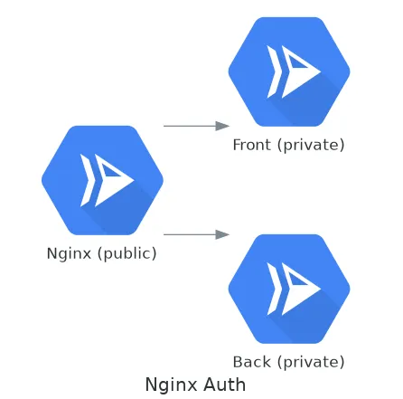

# Autenticar nginx mediante el método service-to-service en GCP

Imaginad que estamos montado una serie de microservicios en [Cloud Run](https://cloud.google.com/run) donde el endpoint es un nginx y no queremos tener el resto de servicios públicos.



Google nos provee de un método de autenticación [service-to-service](https://cloud.google.com/run/docs/authenticating/service-to-service). Perfecto, ¿cómo hacemos eso en nginx? Pues usando el módulo [ngx\_http\_auth\_request\_module](http://nginx.org/en/docs/http/ngx_http_auth_request_module.html) y el [njs scripting language](https://nginx.org/en/docs/njs/).

El código que necesitamos en nginx es el siguiente:

```nginx
js_include conf.d/auth.js;

server {
    listen 80 default_server;
    server_name _;

    location / {
        auth_request /_oauth2;
        auth_request_set $authorization $sent_http_authorization;
        proxy_set_header Authorization $authorization;
        proxy_pass https://patinando-int-api-tfezajqgva-ew.a.run.app;
    }


    location = /_oauth2 {
        internal;
        js_content introspectAccessToken;
    }

    location = /_oauth2_send_request {
        internal;
        proxy_set_header  Metadata-Flavor Google;
        proxy_pass http://metadata/computeMetadata/v1/instance/service-accounts/default/identity?audience=https://patinando-int-api-tfezajqgva-ew.a.run.app;
    }
}
```

```javascript
function introspectAccessToken(r) {

    r.subrequest("/_oauth2_send_request",
                 function(reply) {
                     if (reply.status == 200) {
                         r.headersOut['AUTHORIZATION'] = 'Bearer ' + reply.responseBody
                         r.status = 204;
                         r.sendHeader();
                         r.finish();
                     } else {
                         r.return(401);
                     }
                 }
                );
}
```

En nuestro caso nuestro servicio interno es _https://patinando-int-api-tfezajqgva-ew.a.run.app_ y si lanzamos un _wget_ obtenemos un bonito 403:

```
HTTP request sent, awaiting response… 
 HTTP/1.1 403 Forbidden
 Date: Sun, 03 May 2020 11:36:33 GMT
 Content-Type: text/html; charset=UTF-8
 Server: Google Frontend
 Content-Length: 295
2020–05–03 11:36:33 ERROR 403: Forbidden
```

Lo que estamos haciendo con este código es decir que toda petición se tiene que autorizar con `/_oauth2` que es una llamada interna y contiene el código de la función en javascript.

El código javascript a su vez llama a `/_oauth2_send_request` para obtener el token.

Para poder usar la cabecera que seteamos en javascript con

```
r.headersOut[‘AUTHORIZATION’] = ‘Bearer ‘ + reply.responseBody
```

es necesario añadir estas líneas en el location principal

```
 auth_request_set $authorization $sent_http_authorization;
 proxy_set_header Authorization $authorization;
```

Si ahora hacemos peticiones al nginx la api nos devolverá un 200:

```
HTTP/1.1 200 OK
 Server: nginx/1.17.10
 Date: Sun, 03 May 2020 11:44:56 GMT
 Content-Type: application/json
 Content-Length: 5436
 Connection: keep-alive
 vary: Authorization
 x-powered-by: PHP/7.4.5
 cache-control: no-cache, private
```

Referencias:

-   [https://www.nginx.com/blog/validating-oauth-2-0-access-tokens-nginx/](https://www.nginx.com/blog/validating-oauth-2-0-access-tokens-nginx/)