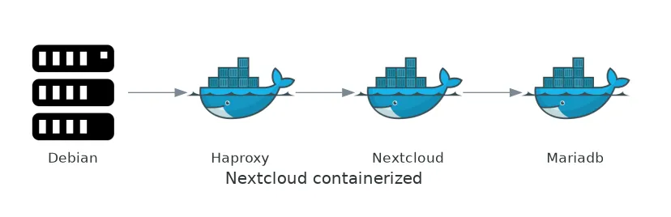
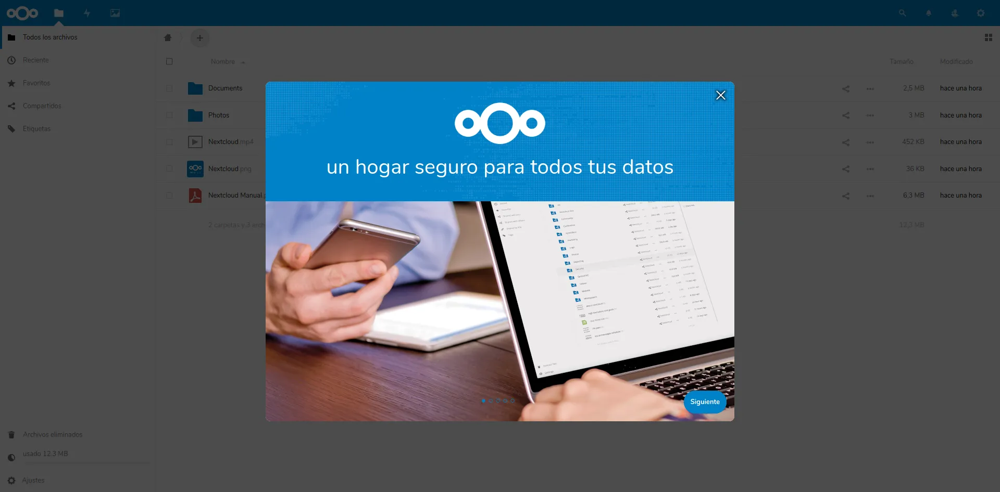

# Desplegar Nextcloud en Docker usando Ansible

Nextcloud nos permite tener nuestro propio [servidor de archivos](https://nextcloud.com/files/) a lo Dropbox. Pero a mí lo que más me gusta es poder tener [mi calendario y mis contactos](https://nextcloud.com/groupware/) independiente del todopoderoso Google.

Vamos a ver como podemos desplegar Nextcloud en una Debian usando Docker y todo ello automatizado con Ansible.

El esquema que vamos a tener es una máquina Debian con tres contenedores dentro:

-   haproxy
-   nextcloud
-   mariadb



## Requisitos

-   Tener acceso root a la máquina Debian.
-   Tener instalado Ansible.

A mí personalmente me gusta instalar Ansible en un virtualenv de python:

```
$ virtualenv3 venv/py3
$ source venv/py3/bin/activate
(py3)$ pip install ansible
```

Instalamos los roles necesarios:

```
(py3)$ ansible-galaxy install jilgue.ansible_role_docker_nextcloud
(py3)$ ansible-galaxy install jilgue.ansible_role_docker_haproxy
```

## Playbook

A continuación vamos a generar la configuración de Ansible.

Necesitamos generar el inventario:

```ini
nextcloud ansible_ssh_host=192.168.56.20
```

También la configuracion del haproxy:

```cfg
global
    daemon
    maxconn 256

defaults
    mode http
    timeout connect 5000ms
    timeout client 50000ms
    timeout server 50000ms

frontend http-in
    bind *:80
    mode http
    default_backend servers

backend servers
    server server1 nextcloud:80 maxconn 32
```

Y por último el playbook:

```yaml
---
- hosts: all
  become: true
  become_method: sudo

  vars:
    nextcloud_trusted_domains: 192.168.56.20
    nextcloud_ports: []
    haproxy_cfg_template_path: "{{ playbook_dir }}/"
    haproxy_links:
      - nextcloud
    haproxy_ports:
      - 80:80

  roles:
    - { role: nextcloud, tags: [ 'nextcloud' ] }
    - { role: haproxy, tags: [ 'haproxy' ] }
```

Y con esto tendríamos todo, al aplicar el playbook y entrar en la url [http://192.168.56.20](http://192.168.56.20/) podremos ver nuestro nextcloud instalado.

El usuario y contraseña por defecto son [_admin / admin_](https://github.com/CallePuzzle/ansible-role-docker-nextcloud/blob/master/defaults/main.yml)_._



Podéis ver la configuración de mi propio servidor en [github](https://github.com/CallePuzzle/ansible-playbook-hetzner-cloud).
