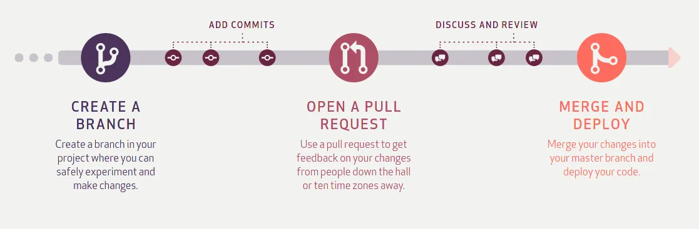
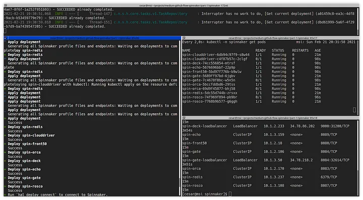
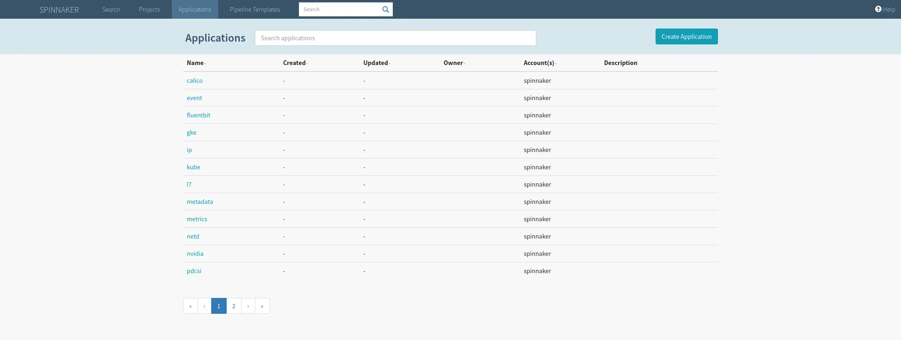

# GitHub Flow with Spinnaker (Part 1)

In the microservices world, a way to work is following [GitHub Flow](https://guides.github.com/introduction/flow/):



The microservices’ repositories are small and simple because we have many repositories, each with a very specific functionality. So we can apply the premise that we are only going to work on one task or pull request per project because the code’s live cycling will be too short. And under this premise, we’re going to build a deployment flow in Kubernetes using Spinnaker.

The first step is to install and configure Spinnaker. An easy way for this is to follow the guide [https://cloud.google.com/solutions/continuous-delivery-spinnaker-kubernetes-engine](https://cloud.google.com/solutions/continuous-delivery-spinnaker-kubernetes-engine), but I like only the magic that I understand xD, I prefer to do this the “hard way”.

We’re going to install Spinnaker using the Kubernetes Provider ([https://spinnaker.io/setup/install/providers/kubernetes-v2/](https://spinnaker.io/setup/install/providers/kubernetes-v2/)) so we need two clusters, one for Spinnaker and another to simulate the environments.

Other things we need:

-   A project in Google Cloud Platform
-   gcloud cli tool
-   Terraform
-   Docker

There is the code to deploy all in this [repository](https://github.com/jilgue/medium-github-flow-spinnaker).

```
$ git clone https://github.com/jilgue/medium-github-flow-spinnaker
$ cd medium-github-flow-spinnaker
```

We have to change the variables.tf with our project and the region we want.

Perfect we are ready, let’s deploy our k8s clusters:

```
$ cd infra/part-1/01-gke/
$ terraform init
$ terraform apply
```

Once deployed, we connect to the cluster, in my case:

```
$ gcloud container clusters get-credentials spinnaker --region us-east1 --project callepuzzle-lab
```

Now we need one bucket to store the Spinnaker’s data and one service account to allow Spinnaker to manager these data:

```
$ cd ../02-gcs/
$ terraform init
$ terraform apply
```

Great, finally we can deploy Spinnaker with Halyard’s help. Halyard is a command-line administration tool that manages the lifecycle of your Spinnaker deployment. We’re going to use the Docker way to install Spinnaker.

```
$ cd ../03-spinnaker/
$ docker run --name halyard --rm -v $(pwd):/home/spinnaker/.hal -v ~/.kube:/home/spinnaker/.kube -it us-docker.pkg.dev/spinnaker-community/docker/halyard:stable
$ docker exec -it halyard bash
$ source <(hal --print-bash-completion)
```

It’s a very important mount, inside the docker container, the current path and the kube config. Because we will need the service account’s key generated in the previous step, Halyard also generates the configuration in /home/spinnaker/.hal and we don’t want to lose our config when Docker is stopped.

We create a service account in Kubernetes and update the connection credentials:

```
$ CONTEXT=$(kubectl config current-context)
$ kubectl apply --context $CONTEXT \
   -f https://www.spinnaker.io/downloads/kubernetes/service-account.yml
$ TOKEN=$(kubectl get secret --context $CONTEXT \
  $(kubectl get serviceaccount spinnaker-service-account \
      --context $CONTEXT \
      -n spinnaker \
      -o jsonpath='{.secrets[0].name}') \
  -n spinnaker \
  -o jsonpath='{.data.token}' | base64 --decode)
$ kubectl config set-credentials ${CONTEXT}-token-user --token $TOKEN
$ kubectl config set-context $CONTEXT --user ${CONTEXT}-token-user
```

We add the provider and the storage, and set the Spinnaker’s version.

```
$ hal config provider kubernetes enable
$ hal config provider kubernetes account add spinnaker \
   --context $CONTEXT
$ hal config deploy edit --type distributed --account-name spinnaker
$ hal config storage gcs edit --project callepuzzle-lab \
   --bucket-location us \
   --bucket spin-a83f8821-132b-4a68-a0d7-c50b505aa8f3 \
   --json-path ~/.hal/gcs-account.json
$ hal config storage edit --type gcs
$ hal config version edit --version 1.24.4
$ hal deploy apply
```

We create the load balancers to expose Spinnaker:

```
$ kubectl apply -f spin-deck-loadbalancer.yaml
$ kubectl apply -f spin-gate-loadbalancer.yaml
```

Override the api and ui urls when the load balancers are already deployed and have external IP:

```
$ kubectl -n spinnaker get services
NAME                     TYPE           CLUSTER-IP   EXTERNAL-IP    PORT(S)          AGE
spin-clouddriver         ClusterIP      10.1.2.145   <none>         7002/TCP         15m
spin-deck                ClusterIP      10.1.2.228   <none>         9000/TCP         15m
spin-deck-loadbalancer   LoadBalancer   10.1.2.233   34.78.86.202   9000:31200/TCP   3m54s
spin-echo                ClusterIP      10.1.3.159   <none>         8089/TCP         15m
spin-front50             ClusterIP      10.1.2.18    <none>         8080/TCP         15m
spin-gate                ClusterIP      10.1.2.106   <none>         8084/TCP         15m
spin-gate-loadbalancer   LoadBalancer   10.1.3.50    34.78.218.2    8084:32614/TCP   3m51s
spin-orca                ClusterIP      10.1.2.170   <none>         8083/TCP         15m
spin-redis               ClusterIP      10.1.3.237   <none>         6379/TCP         15m
spin-rosco               ClusterIP      10.1.3.108   <none>         8087/TCP         15m

$ hal config security ui edit --override-base-url http://34.78.86.202:9000
$ hal config security api edit --override-base-url http://34.78.218.2:8084
$ hal deploy apply
```



Finally we can access Spinnaker with the url [http://34.78.86.202:9000](http://34.78.86.202:9000/):



In the next article we will add another cluster and we will configure the CI/CD.