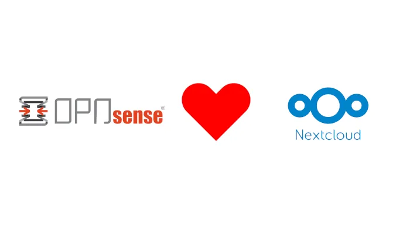
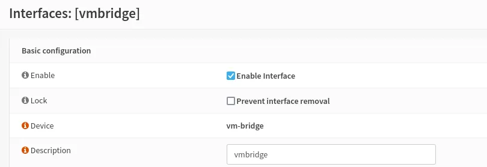
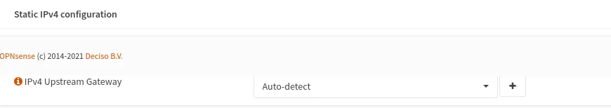
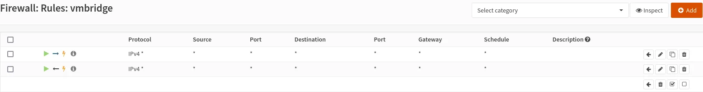

# Running Nextcloud on OPNsense

In this article we’re going to see how to run [Nextcloud](https://nextcloud.com/) on a [OPNsense](https://opnsense.org/).



The first question is:

## Why do you do this?

Well, I haven’t used Google services for many years, except maps. I haven’t found a good alternative to Google Maps. I had a Nextcloud installed on a virtual machine hosted in [Hetzner](https://www.hetzner.com/cloud). It’s ok, it worked perfectly. But I needed more resources, more space for photos and videos, so I decided to migrate Nextcloud to my home.

I have a OPNsense router and firewall for my home. It has enough memory, so why have another device running when I can just use Nextcloud?

The next question is:

## Can OPNsense run Nextcloud?

At first, I thought about using Docker, but the [FreeBSD port of Docker project](https://github.com/kvasdopil/docker) hasn’t been updated in 6 years.

The second idea was to try to install Nextcloud on FreeBSD using the [OPNsense ports](https://github.com/opnsense/ports). Bad idea. Nextcloud has a lot of dependencies, it’s too complex to install and impossible to maintain.

And then I found this article [https://yom.iaelu.net/2020/05/freebsd-using-docker-and-kubernetes/](https://yom.iaelu.net/2020/05/freebsd-using-docker-and-kubernetes/). Really? Can I have a virtual machine inside OPNsense and run Docker inside this virtual machine?

Perfect, welcome to Inception.

## Create a Debian virtual machine

The project we’re going to use is [https://github.com/churchers/vm-bhyve](https://github.com/churchers/vm-bhyve)

```
# cd /usr/ports/sysutils/vm-bhyve/
# make install clean
# cd /usr/ports/sysutils/grub2-bhyve/
# make install clean
# sysrc vm_enable="YES"
# mkdir -p /srv/vm
# sysrc vm_dir="/srv/vm"
# vm init
# curl -o /srv/vm/.templates/debian.conf https://raw.githubusercontent.com/churchers/vm-bhyve/master/sample-templates/debian.conf
# vm switch create -p -a 192.168.23.0/24 bridge
# vm create -t debian -s 80G debian
```

Ok, at this point we need to enabled the interface created by vm-bhyve and to allow the network traffic in OPNsense.








All ready to install Debian:

```
# vm install debian debian-10.9.0-amd64-netinst.iso
# vm console debian
```

In the network configuration step, we have to select manual configuration and set a static IP.

## Install Nextcloud

Perfect, we have a Debian machine with its own IP. The good thing about this method is that I can use the same Ansible playbook to install Nextcloud that I used in previous machine hosted in Hetzner:

[https://github.com/CallePuzzle/ansible-playbook-nextcloud-debian](https://github.com/CallePuzzle/ansible-playbook-nextcloud-debian)