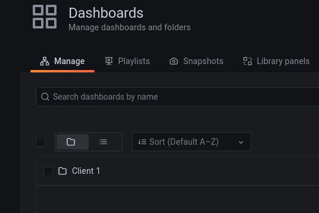

A way to configure a multi-tenant environment in Grafana is to use organization to split each tenant. But, how can I configure this by IaC?

Grafana provides an active provisioning system that uses config files. Data sources and dashboards can be defined via files which are version controlled.

There are many tools to manage these config files:

-   [Puppet](https://forge.puppet.com/puppet/grafana)
-   [Ansible](https://github.com/cloudalchemy/ansible-grafana)
-   [Chef](https://github.com/JonathanTron/chef-grafana)
-   [Saltstack](https://github.com/salt-formulas/salt-formula-grafana)
-   [Jsonnet](https://github.com/grafana/grafonnet-lib/)

Grafana provisioning allows the configuration of data sources, plugins, dashboards and alert notification channels. All of these “objects” can be created in a specific organization.

> This is great, what else would you like?
> 
> I would like a little bit more. What happens with the organization or the users? Can I configure them by IaC?
> 
> Yes, you can, and Terraform is going to help with that.

## Grafana provider

Grafana has an [official Terraform provider](https://registry.terraform.io/providers/grafana/grafana/latest/docs) which includes resources for [users](https://registry.terraform.io/providers/grafana/grafana/latest/docs/resources/user) and [organizations](https://registry.terraform.io/providers/grafana/grafana/latest/docs/resources/organization).

## Multi-tenant configuration

For managing resources in different organizations with Terraform you have to configure Grafana’s provider with the organization ID.

For example:

```hcl
provider "grafana" {
  url  = "http://127.0.0.1:3000"
  auth = "admin:admin"
  org_id = 1
}
```

So, the idea is having two different providers using [alias](https://www.terraform.io/language/providers/configuration#alias-multiple-provider-configurations). The first creates an organization and an admin user with the principal admin user. And the second uses organization and users created in the previous step.

Example:

```hcl
provider "grafana" {
  url  = "http://127.0.0.1:3000"
  auth = "admin:admin"
  alias = "admin"
}provider "grafana" {
  url  = "http://127.0.0.1:3000"
  auth = "admin_org_2:pass_org_2"
  org_id = 2
  alias = "config"
}
```

## Full example

Enough theory, let’s take a practical example. For this you need:

-   [Terraform](https://www.terraform.io/downloads)
-   [Kind](https://kind.sigs.k8s.io/)
-   Cloning this repository: [https://github.com/jilgue/medium-grafana-multi-tenant](https://github.com/jilgue/medium-grafana-multi-tenant)
-   [Kubie](https://github.com/sbstp/kubie) (not necessary)

Deploy Grafana in Kubernetes cluster:

```
$ kind create cluster
$ kubie ctx kind-kind
$ cd 010-environment/010-grafana
$ terraform init
$ terraform apply
$ terraform output admin_password
$ kubectl port-forward service/grafana 3000
```

Our Grafana is accessible from [http://127.0.0.1:3000](http://127.0.0.1:3000/). Let’s create a new organization with its admin user and resources (a folder for this example)

```
$ cd ../../020-client-1/010-grafana-config/
$ terraform init
$ terraform apply
$ terraform output password
```

Now logging with admin or client-1 user and switching the organization we will see the folder created.


